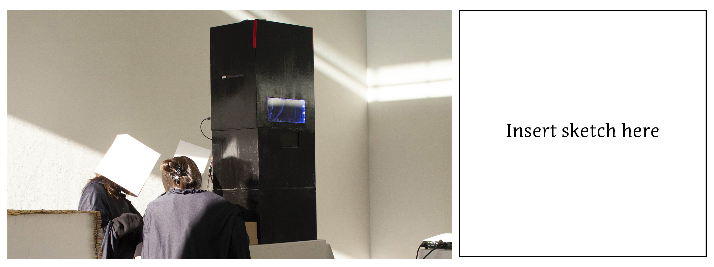
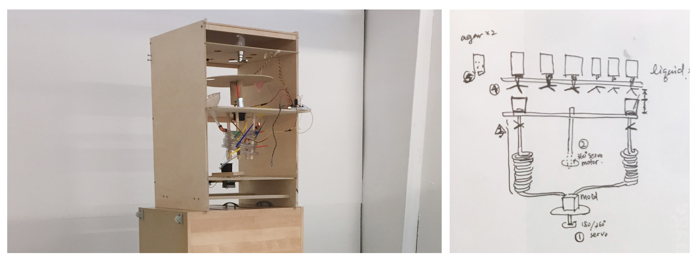
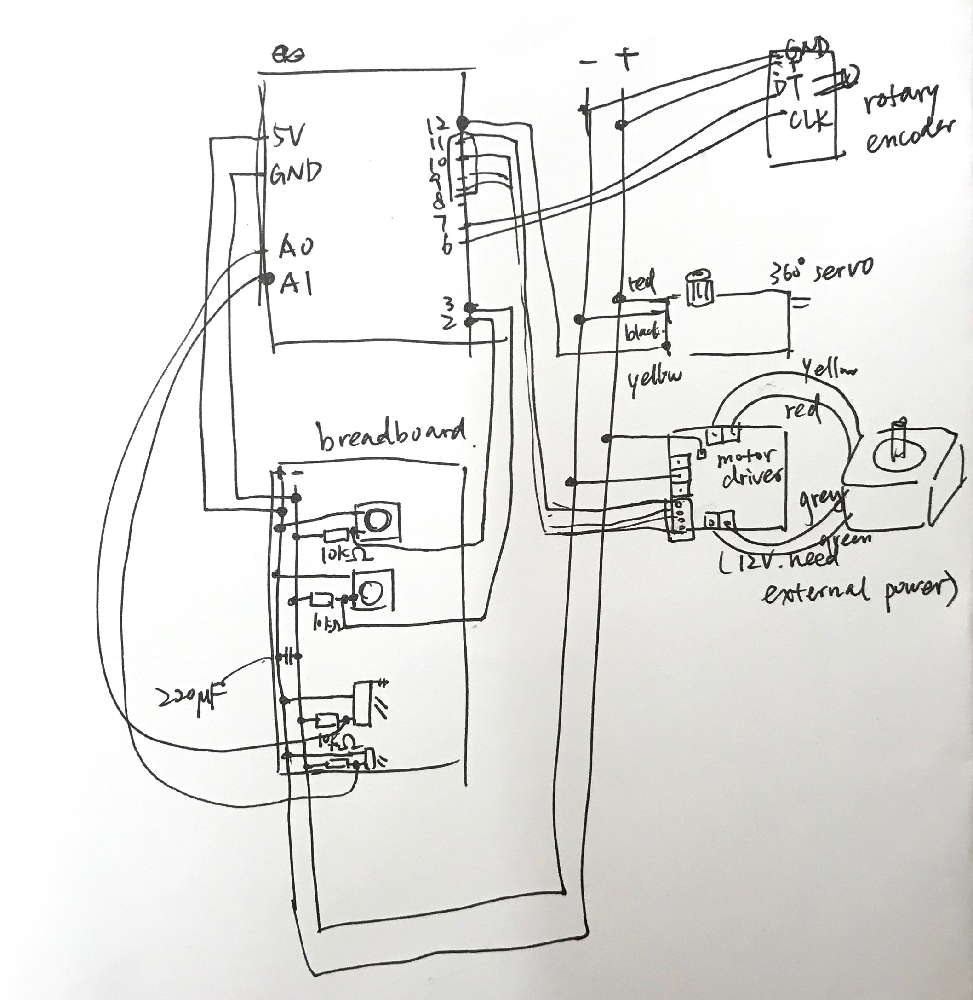

# Fortune-Telling Machine

## The project

The *Fortune-Telling Machine* is a speculative, design fiction project about belief for a CCA MFA Design studio course: Carry-On Manufacturing (co-taught by Matthew Boyko & Helen Ip.) It illustrates an alien civilization that sends back a machine to the present for historical research. This machine can response to a question about a person's future with an edible cube, whose message can only be fully understood by being eaten. The design fiction is shown through a 5-to-10-min performative experience. The interaction between the audience and the machine is facilitated by an alien priest, an alien machine operator, and a human translator. 

*For more info about the project: [link to be updated].* 

## The machine and the codes

This repository contains two versions of the Arduino codes for the Fortune-Telling Machine (in the "code" folder,) together with the music files for the second and most recent version (in the "music" folder.) Both versions use Arduino Uno boards to control the electronic components to show certain automaticity. However, the structures of the two machines and components used are largely different. 

### Version 2 

The most recent ver. machine has three stacking modules:

- Box A on the top holds six inverted bottles of hot liquid. Each kind of liquid can flow through a tube to Box B, controlled by **an electric valve.** There is also a rectangular window at the bottom of the front side to reveal liquid movement. The window is surrounded by **an LED strip.** Together with **a sound speaker** attached inside, the LEDs show different effects to indicates machine calculation. Besides, **An Arduino Uno board** is placed in Box A. It can randomly select two kinds of liquid and switch between pre-determined sound/light effects.
- In the middle is Box B, the working space of the alien operator. Here placed the ingredients and most of the tools to quickly make the "answer" (an agar agar jelly.) A smaller window for presenting the final result is at the top on the front side. Also in Box B, the operator pushes **a button** to control the Arduino which consequently switches among different states.  
- Finally, Box C, at the bottom, is the storage space for dry ice and other tools.

[^ Figure 1]: The v2 machine (left) and sketch (right). *---Image to be replaced---*

For this version, one Uno board controls all the components. There are two programs used for the exhibition.

- "Valves_only" is for valves installation, deinstallation, or other tests.
- "FortuneTelling" is the main program. When the button is pushed, it executes the following cases:
  1. **Scanning:** the light & sound tell the audience the machine is as if scanning their questions and calculating the answers.
  2. **Drop liquid No.1:** the program randomly switches a valve on and let the fluid flow down.
  3. **Drop liquid No.2:** ditto.
  4. **Making:** a series of light & sound effects, showing the machine is producing the results, counting down, and presenting the answer. During this 5-min period, the operator makes the jelly and delivering it through the window on Box B.
  5. **Off:** the default state. Nothing happens.

*[video to be uploaded]*

[^ Figure 2 ]: V2 schematic. *--- to be replaced with fritzing image---*

### Version 1 

In terms of the mechanism, there are a lot of changes between the first and second versions. At this early prototyping stage, eight shot dispensers form a circle on the top of the machine, each holds a different kind of liquid. One main Arduino Uno board controls 360° servo motor, a rotary encoder, a photocell, and a stepper motor. Another Uno board controls the neopixel strip. The structure is shown in the image below.

[^figure 3 ]: The v1 prototype (left) and sketch (right). Eight liquid dispensers sit on the top in a circle. A black 360° servo motor (in the middle) drives a disc with two plugged funnels through a shaft and a rotary encoder on the other end of the shaft. Liquid and powder mixtures go down through two spiral tubes and come into the black mold resting on a platform drived by a stepper motor. There's also a neopixel loop sticked to the wood board under the dispensers. *---Image to be replaced---*

The operator does as follows: 

1. Push the button for neopixel. It shows scanning and calculating effects.
2. Push the other button for liquid selection: 
   - The main Uno board randomly selects two kinds of liquid. 
   - A 360° servo motor spins a disc with a rotary encoder around the center to bring a plugged funnel under the first designated dispenser. The operator needs to push up the dispenser to drop the liquid in a short time. 
   - Then the motor spin to bring another funnel under the second dispenser. The operator does the job again. 
   - The disc comes back to its default position. 
3. The operator mixes the liquid with agar agar powder, unplug the funnels to release the mixture. The two mixtures slowIy flow past two spiral tubes, cooling down at the same time.
4. When the mixtures get closer to the end, the operator pushes the same button again for molding. The stepper motor will randomly select a pre-programmed movement. As the two mixtures go into the mold, they form a pattern.
5. Cool down and demold.

[^ figure 4]: V1 schematic. *--- to be replaced with fritzing image---*

This version was later replaced because the mixtures are easily stuck in the tubes.

## Credits

### Libraries

### Contributors

