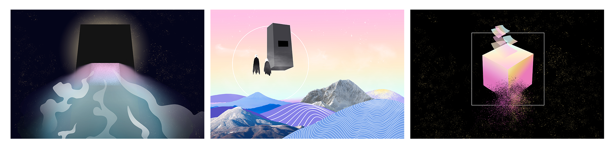
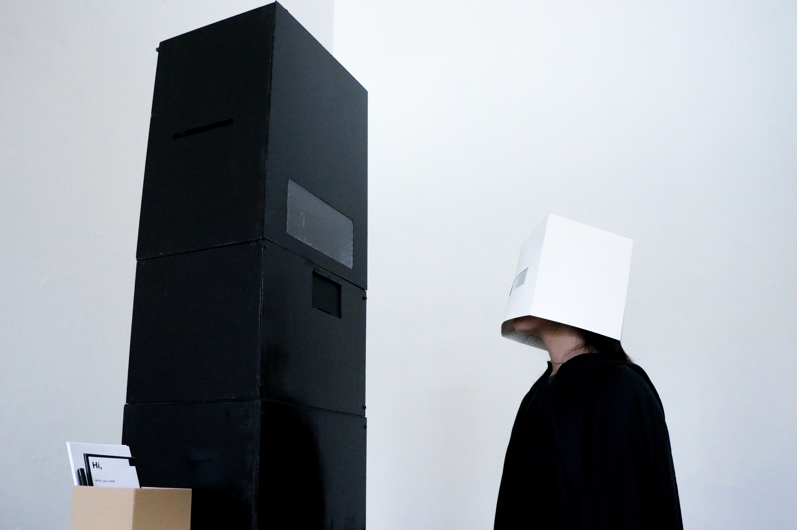
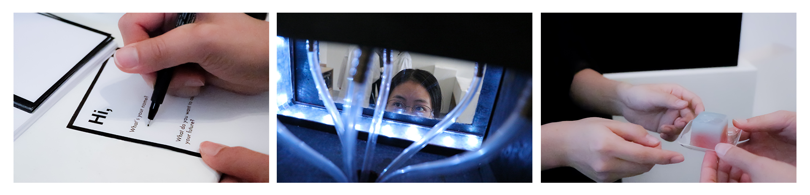
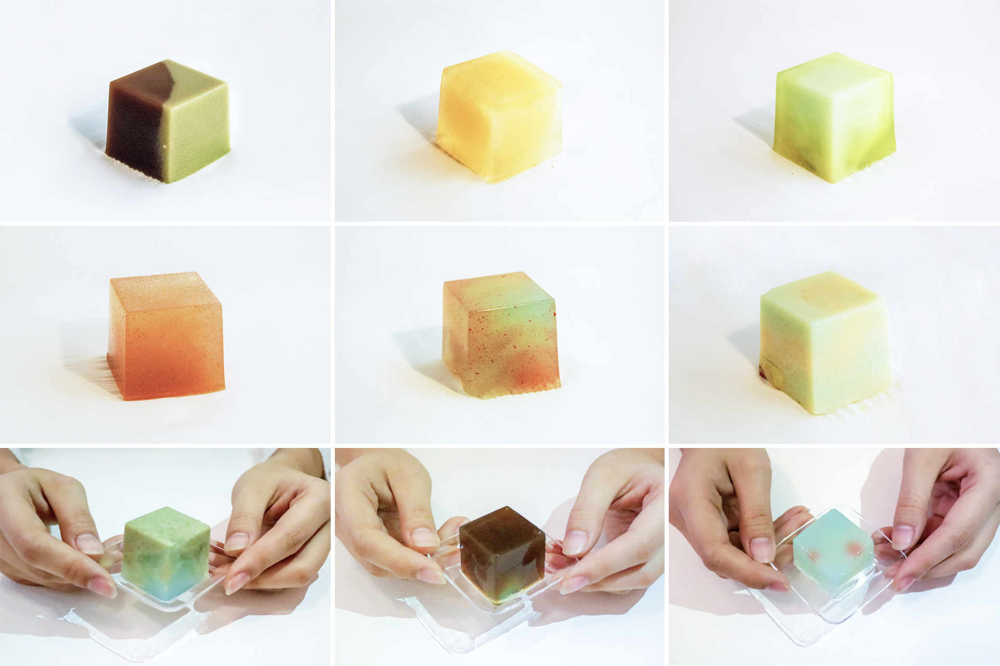

# Project Description

## Overview

"Black Box" is an information machine brought back from the future by an alien civilization (the "Cubies") for data collection. It can answer a question about the future for anyone in the present day. The secret response, however, is contained within an edible cube, as this is the way the Cubies store confidential data for security reasons. The message can only be fully decoded and comprehended by eating and digesting it.

With this fictional yet somewhat conceivable premise, we intend to spark thinking about the deep-seated desire to know the unknowable future, particularly at a time when big data and ever-growing computational power are helping humans predict more and more. The project is primarily an inquiry into the cross-time, cross-regional, and cross-cultural prevalence of fortune-telling. Why is it so powerful? How does it function? What makes people find it believable or valid, even? Secondly, the project explores the idea that present-day gene-testing services could be fortune-telling in a new guise; scientism and techno-fetishism could be modern superstitions. Perhaps every generation of every society is imbued with some innate supernaturalism. Finally, the project poses the "determinism" question: what if accurate fortune-telling is possible? What if there exists a machine that can predict every detail of the future?

To bring this fictional scenario to life, the team produced the Black Box and created a participatory, performative experience. It was built with plywood, tubes, circuits and other materials; we selected outer-space music and created a storytelling video to be played during the show; and we dressed up in cloaks and masks to look like two alien Cubies, as well as a human ambassador who facilitates interactions between the visitors and the machine. A visitor writes down their name and a question about their future, then places it in the machine. In the following five minutes, the machine processes the information and produces the "answer" (a 1.5-inch cube), which is then given to the visitor. After receiving the question sheet, the machine randomly selects two kinds of liquid of different colors and tastes, from a total of six. We then manually combine these with agar-agar powder, pour the mixture into a cubic mold, and use dry ice to solidify it into jello. During this process, while the making process is hidden from the visitor, the machine produces light and sound effects to suggest that it is calculating and manufacturing a result. The jello cube, with its random colors, tastes, and patterns, is the "answer"; its meaning is completely open to the visitor's interpretation.

The Black Box was a studio project for the course, "Carry-On Manufacturing," at California College of the Arts (CCA), co-taught by Matthew Boyko and Helen Ip. We initially presented it at the course exhibition to the CCA community in December 2018.

## Details

### The design fiction: The Black Box from a time-traveling alien civilization can tell your future in the form of an edible cube
Time-traveling aliens with cubic heads from the future brought a mysterious machine back to Earth, announcing that they want to gather historical data and that, in return, they will give everyone a peek into their future. For these beings, the square is a symbol of wisdom and divinity. We call them the Cubies; the machine, the "Black Box.”

The Cubies live in a society where data is insecure, and so they preserve confidential information in edible cubes. The Black Box is one of the machines that can infuse secrets into these information cubes. The message inside can only be accessed by digesting it.

With the help of two Cubies and a human ambassador, each person has a chance to ask the Black Box a question about their future. Visitors write down their name and question on a sheet of paper, which is then inserted into the Black Box. The machine then processes the question, calculates its response, and produces an edible answer in about five minutes. The lucky person can gain a glimpse of their future by eating the answer.

The team's intention was to tell the design fiction through a performative experience, in order to provoke thinking about fortune-telling and belief in a contemporary context. Inspired by The Book of Answers by Carol Bolt, a book that can answer any question with ambiguous pieces of text, we decided to create a similar experience that also references the Delphi Oracle, astrology, tarot, and other forms of fortune-telling and divination. The Black Box's "answers" are, essentially, randomly generated. They are also innately vague, as they don't contain any words, but only variations of color, pattern, and taste. This stimulates the innate human tendency to find patterns and draw connections, thus making it possible to imbue the "answer" with subjective interpretations. We designed the machine, the recipe for the "answers," the costumes, and other props that enrich the scenario's context. Furthermore, we created an introductory video and selected outer-space music to help clarify the story and immerse the audience in it.

 

### The message: The implications of fortune-telling when we can predict our lives

Through this experience of a fictional reality, we pose questions about the existence of fortune-telling, and the implications of these questions at a time when we have a constantly strengthening power to make predictions about almost anything.

From ancient divination to today's popular fortune-telling activities, a range of cultures has looked for patterns in natural objects, body parts, and divination tools, as people continually attempt to gain knowledge of the unforeseeable future. From oracles in Ancient Greece and the Yi Jing in China, to horoscopes and tarot readings in popular culture today, these activities endured through the scientific revolutions since the Renaissance and gains even more popularity with their commercialization and stressful modern life. They can bestow a sense of control over the fear and anxiety of uncertainty, providing people with the courage to make decisions. Their pervasiveness speaks to a human propensity towards finding meaning and the need for belief systems. Auto-suggestion and the intrinsic partial validity of vague signs allow them to be perceived as "true" and even mystical. Without this, they would not have been and would not remain so prevalent.

Though mainstream modern society largely rebuffs superstitious activities, DNA testing can be seen as a scientific form of fortune-telling that also involves supernaturalism. What would be the ideal extent to which a genome could predict one's life, and how much can it predict based on existing technologies? Just as fortune-tellers utilize a human inclination towards symbolism, gene-testing services may also manipulate customers' perceptions for their own commercial interests. When science becomes a black box to outsiders, scientism and techno-fetishism become modern superstitions.

Furthermore, what if we could tell the future with 100% accuracy? Expanding computational power promises us an increasingly predictable world. As well as mathematical models widely used in areas involving few human activities, there have been attempts to build machines that can predict social events. These include the Living Earth Simulator Project by FuturICT (2011) and the Nautilus supercomputer produced by a team at UIUC (2011). Despite the criticism they have received, the emergence of such futuristic endeavors challenges our understanding of the world and ourselves.

 

### The design: Being alien, mystical, and satirical

Starting with the slogan "we don't make food, we make a belief," as well as a plausible story, we designed an alien, mystical experience. Main decisions included:

#### Edibles as the answer

We use agar-agar jelly to create the answer cubes because:

- Its alien appearance reinforces the theme.
- Its ambiguity allows free associations with possible meanings. And since each cube is single use, we can produce random results and avoid mistakes.
- The food/drug metaphor offers a tangible experience of digesting and understanding. Eating as a primitive way of "decoding" also produces conflict with the techno-futuristic setting about data security.

#### The metaphor of the cube and the black-box

The cube is the central element of the story and the form language of the design. It stands for knowledge, truth, and perfection in symbolism. And its simplicity makes it both primitive and mysterious. The black-box aligns with these associations of the cube, associations which create a metaphor for fortune-telling activities from ancient to modern times. The physical form of the answer and the aliens' appearance further reinforce these cubic connotations, while the six liquid options that create the answer echo the six sides of a cube.

#### Being ritualistic and mystical

Apart from the use of form languages, we made the experience ritualistic and mystical with other details, including:

- Visual language: almost every object in the experience uses simple square/cube/cuboid shapes and a black and white color scheme to create a mythical, divine feeling.
- Size and arrangement: to create distance and reverence, the machine is put on a pedestal and the window (the only interface) is slightly higher than eye level.
- Machine behavior: during the 5-min answer production process, the Black Box emits strange lights and sounds to suggest that it is engaged in advanced calculations.
- Interaction flow: to make it a ritual, an alien "priest" facilitates all the actions, and the audience cannot touch the machine.

 

### The making: The path to "creating a belief"

It took two months from conception to exhibition to complete the project. First, we designed the formula for the answers by testing various kinds of food thickeners and experimenting with pattern-making. We chose agar-agar powder because its solidifying point is close to room temperature, making it easy to control. We decided to make the cubes by pouring two types of liquid into a cubic mold in different ways, since this method easily produces varying but always beautiful results.

Then we built the working prototype with wooden structures and Arduino circuits, which was finalized through a series of tests and iterations. In the final version, the machine has three stacking modules. The box at the top preserves and dispenses the liquids using bottles, tubes, and valves. The middle box has a transparent window bordered by an LED strip. This window is the only interface between the visitors and the machine, and this section also provides space for the alien operator. The box at the bottom adds height to the overall object, making it suitable for operation, and can also be used as a storage space.

Lastly, we designed additional components that complete the experience, including the question sheet, the Cubies' costumes, and introductory videos. All these elements adhere to the same form language as the machine and therefore reinforce the project's underlying principles.

For more details:

- [Design process](https://drive.google.com/file/d/1VgLE5v_DhbejvS0L9a9aLpfb2G2ujM_3/view?usp=sharing)
- [Prototype info](README.md/#the-machine-and-the-codes)